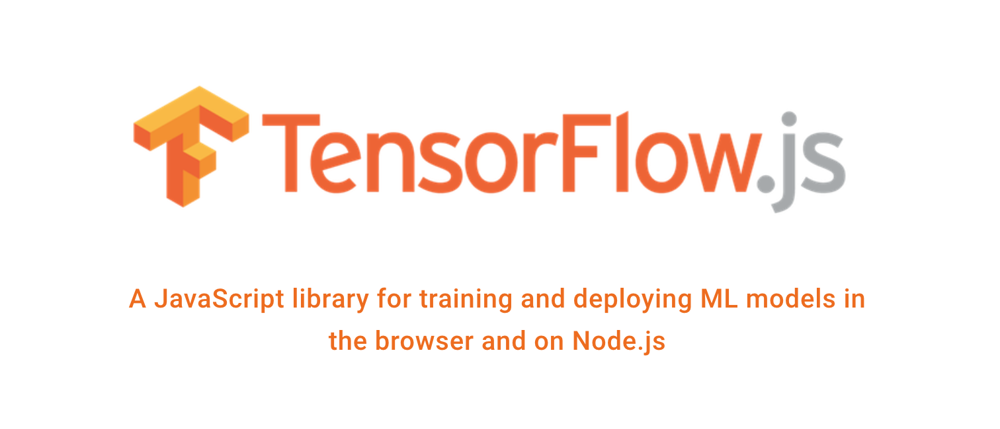

It has been great 4 years contributing to open source. I got the opportunity to work with organizations like [Mozilla](https://mozillians.org/en-US/u/manrajsingh/), [DuckDuckGo](https://duckduckhack.com/u/manrajgrover/), [OpenMF](http://mifos.org/) and of course [TensorFlow](https://js.tensorflow.org/). One of my main motive behind contributing to a project is learning. So a year back, when I was exploring the field of Machine Learning, I stumbled upon a project called [deeplearn.js](https://ai.googleblog.com/2017/08/harness-power-of-machine-learning-in.html). It was recently open sourced by [Google + PAIR Code initiative](https://ai.google/research/teams/brain/pair) and focused on bringing machine learning to the web. I decided to get involved in the project for multiple reasons:

    <i>Taken from: https://twitter.com/deeplearnjs</i>

1. Machine Learning on the client side is great for privacy and would enable real-time experiences and visualizations. Also, +1 for [federated learning](https://ai.googleblog.com/2017/04/federated-learning-collaborative.html).
2. It was fairly new and didn't have many operations and algorithms implemented. This would give me the opportunity to implement them.
3. It made use of technologies I didn't have experience with and wanted to learn them at some point in time.

Working on a new code base is always overwhelming at first. I started by reading the documentation and trying to understand how individual methods work and how they exploit WebGL for fast computations. While doing this, I found a few bugs on the website and thought of fixing them. The contribution process was just like any other open source project:

1. Open an issue elaborating on the bug you found and how you think it can be fixed.
2. Prepare a well-written, well-tested and well-documented pull request explaining what the fix does exactly.

The community was very welcoming. I had my [first pull request](https://github.com/tensorflow/tfjs-core/pull/214) merged in no time. This motivated me to fix more and more bugs. When I was comfortable with the codebase, I started implementing methods that were missing from the API including mathematical, logical and control flow operations.

deeplearn.js provided a [graph-based](https://www.tensorflow.org/guide/graphs) API (similar to TensorFlow) which was replaced by the [eager mode](https://www.tensorflow.org/guide/eager) during the migration to TensorFlow.js. I worked on implementing gradients for various operations and optimizers enabling them to be invoked eagerly. A good part of my contributions went into fixing documentation and development aspects of the project. 

    <i>Taken from: https://js.tensorflow.org/</i>

During [TensorFlow Dev Summit 2018](https://www.tensorflow.org/dev-summit/), the announcement regarding deeplearn.js becoming part of the TensorFlow organization as TensorFlow.js was made. This opened up the project to a wider community and enabling new tools to be built around it. deeplearn.js became [TensorFlow.js Core API](https://github.com/tensorflow/tfjs-core) which mimics TensorFlow Python API. [Layers API](https://github.com/tensorflow/tfjs-layers) was introduced which acts as an abstraction over Core API for easy development of ML models (like [Keras](https://keras.io/)). [TensorFlow.js Converter](https://github.com/tensorflow/tfjs-converter) allowed developers to use already trained TensorFlow models to be executed in the browser. Finally, [TensorFlow.js Node API](https://github.com/tensorflow/tfjs-node) binds TensorFlow C API to Node.js allowing developers to use JavaScript on servers for training and inference purpose.

With more people getting involved and building projects over TensorFlow.js,  the project became more developer focused. This also required building [examples](https://github.com/tensorflow/tfjs-examples) and [models](https://github.com/tensorflow/tfjs-models) that would showcase the capabilities of the project. I shifted my focus to developing them for the project website. The team shared a well-curated list of examples with me. While building these examples, I found some loss and reduction operations to be missing and implemented those.

It has been a great journey contributing to TensorFlow.js and I've really learned a lot during the process. Shout out to the whole team, especially [Nikhil Thorat](https://twitter.com/nsthorat), [Daniel Smilkov](https://twitter.com/dsmilkov), [Shanqing Cai](https://twitter.com/sqcai) and [Stanley Bileschi](https://twitter.com/xtan) for building such a wonderful project and guiding me throughout my contributions. You all are awesome! I'm really excited to see new contributors getting involved in the project and other projects being built over TensorFlow.js. The future of machine learning on the web is bright and I'm happy to be a small part of it.

Finally, thanks to the Google Open Source team for recognizing my efforts, honoring me with the Google Open Source Peer Bonus award and giving me the opportunity to share my experience with everyone through this post.

*This post was originally written for Google Open Source Blog*
